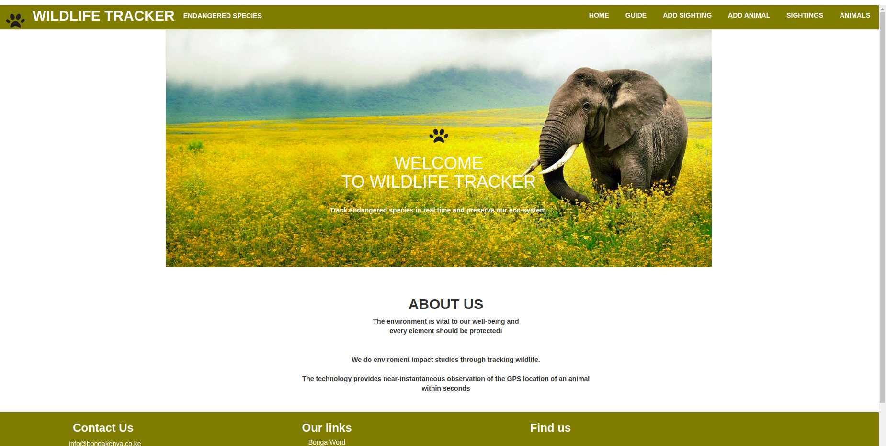

# Wildlife Tracker @254!

## Author

Njoki Kamau
 
 
 
 ## Link to Deployed Site
 [Deployed Site](heroika.herokuapp.com/)

 ## BDD
 
|Behavior | Input| Output|   
|---------|------|-------|
|Attach different heroes to the form| User puts in details of Squad| Pre-determined heroes are grabbed and displayed, when checkbox is checked|
|User is able to create a squad object| use forms| squad object created is stored for reference|
|The squad created is stored as data and displayed in different page, retrievable| use postgress or SQL| the users creation are availabe even after refresh.|
 
 ## Project Description
 Wildlife Tracker is an application that allows Rangers to track wildlife sightings in the area.
 
 The application tracks two categories of wildlife: non-endangered animals and endangered animals. 
 Endangered animals due to their fragilities have more properties eing accounted for
 
 ## Project Set Up
 
 - Make sure all requirements for running java applications are installed;
    - java
    - JDK - Java Development Kit
    - Maven
    - Gradle
    - An IDE - Intellij
 - Clone the project to your local machine from https://github.com/Njoki254/Wildlife-Tracker.git.
 - To view the site visit 
 - Run gradle run to compile and java App.main to run the program.
 
 ## Installing
 After cloning to your local machine navigate to the folder you cloned into and open it with intellij.
 
 - Navigate into the src/main/java/App.java and click run in intellij.
 - Go to your browser and type localhost:4567
 ## Technologies Used
 
 - Java
 - Junit
 - Postgres
 - Intellij
 - HTML
-  CSS
- Markdown

##### MIT Licence
#####  Copyright (c) 2019 Njoki Kamau

